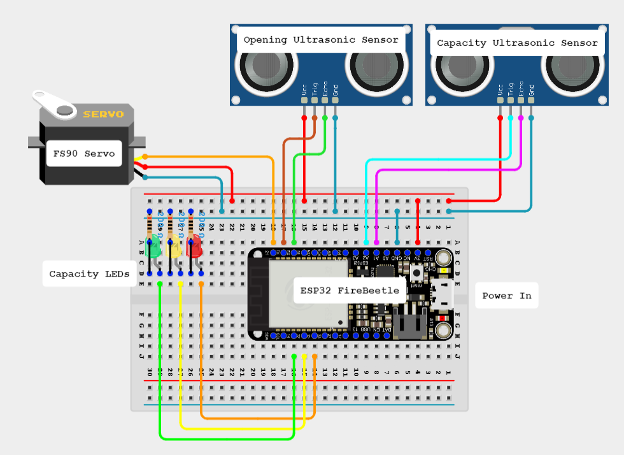
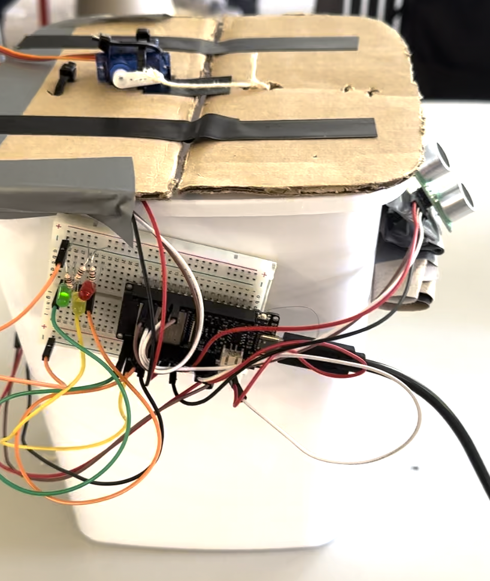

:Author: imran072
:Email: kaziimran072@gmail.com
:Date: 04/10/2023
:Revision: version#1

= Project: Smart Garbage Bin IoT Project

This repository contains the code and documentation for a Smart Garbage Bin IoT project developed as part of an academic endeavor. The project aims to create an intelligent waste management system that monitors bin capacity, detects motion, and provides real-time data visualization through a cloud-based platform. The system utilizes ultrasonic sensors, LEDs, a servo motor, and an ESP32 microcontroller, integrated with the Arduino IoT Cloud platform for remote monitoring and control.

== Step 1: Assemble the Circuit

Assemble the circuit following the diagram layout.png attached to the sketch. Ensure all connections are made correctly according to the wiring diagram provided.

== Step 2: Load the Code

To load the code onto your microcontroller board, follow these steps:

1. Open the Arduino IDE software on your computer.
2. Connect your microcontroller board (ESP32, Arduino Uno, or Raspberry Pi) to your computer using a USB cable.
3. Open the binIotProject_oct04a.ino file from the project repository in the Arduino IDE.
4. Review the code to ensure it matches your setup and requirements.
5. Click on the "Upload" button in the Arduino IDE to compile and upload the code to your microcontroller board.
6. Once the upload is complete, the code will start running on your board, and you can observe the behavior as per your project specifications.

== Step 3: Device-Cloud Communication Setup

The communication between the device and the cloud happens in real-time. Follow these steps to set up the communication:

1. The device connects to a local Wi-Fi network using the SSID and password provided.
2. Configure the device to use the Arduino IoT Cloud service by selecting the unique board and setting up the secret key.
3. Utilize ArduinoIoTPreferredConnection to manage communication with the IoT Cloud.
4. This connection handler uses the SSID and password to establish the connection.
5. Initialize properties using the initProperties function, specifying their type (e.g., READ), update trigger (ON_CHANGE), and callback functions.

== Key Functionalities
1. Fill Level Monitoring​
    * Real-time monitoring of the bin's capacity using ultrasonic sensors.​
    * LED indicators change color based on the fill level.​

2. Occupancy Rate Calculation​
    * Occupancy rate is calculated based on the bin's capacity.​
    * Provides a percentage of how full the bin is.​

3. Servo Control​
    * The servo motor opens the bin when a hand is detected nearby.​

4. Email Alerts​
    * Email alerts are triggered when the bin's fill level crosses predefined thresholds.​
    * Alerts include information about the status of the bin.​

5. Remote Monitoring​
    * Users can access the cloud dashboard to monitor and control the bin remotely.​

​
== Final Product

